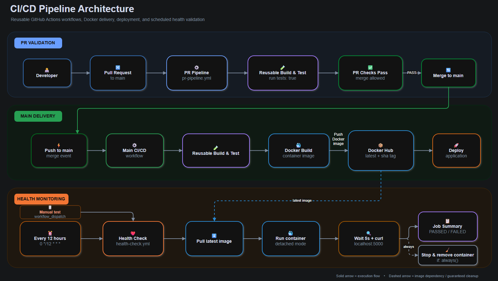

## Login System with Python Flask and MySQL for Beginners

### Requirements(Minimum)

**Major operations handled**

1). Form Design — Login and registration forms with HTML5 and CSS3.<br> 
2). Templates — Flask templates (Jinja2) with HTML and Python.<br> 
3). Basic Validation — Validating form data sent to the server (username, password, and email).<br> 
4). Session Management — Initializing sessions and storing retrieved database results.<br> 
5). MySQL Queries — Select and insert records from/in the database table, via PyMySQL.<br> 
6). Password Security — Passwords are hashed with Werkzeug before being stored, and verified on login (not stored or compared as plaintext).<br> 
7). Routes — Routing points URLs to their handler functions.<br>

**Tech Stack** \
Language: Python 3.11 \
Framework: Flask 3.0 \
Database: MySQL, accessed via PyMySQL (no ORM, no Flask-MySQLdb/mysqlclient) \
Templating: Jinja2 \
Password Hashing: Werkzeug security helpers \
Config: python-dotenv (.env file) \
Production server: Gunicorn
 
**Requirements & Package Versions** \
Python 3.11 (or compatible 3.x — check the box "Add Python to PATH" during install on Windows)\
MySQL Community Server + MySQL Workbench (skip if you already have a MySQL server)

### Installation
Navigate to your current project directory for this case it will be **Login-System-with-Python-Flask-and-MySQL**. <br>

### 1 .Fork the repository and Clone it into your local machine
```csharp
git clone https://github.com/{your-Github-Username }/Login-System-with-Python-Flask-and-MySQL.git
```
          
### 2 .Create an environment
> Check to make sure you are in the same directory where you did the git clone,if not navigate to that specific directory.

Depending on your operating system,make a virtual environment to avoid messing with your machine's primary dependencies
          
**Windows**
          
```csharp
cd Login-System-with-Python-Flask-and-MySQL
py -3 -m venv venv

```
          
**macOS/Linux**
          
```csharp
cd Login-System-with-Python-Flask-and-MySQL
python3 -m venv venv

```

### 3 .Activate the environment
          
**Windows** 

```venv\Scripts\activate```
          
**macOS/Linux**

```. venv/bin/activate```
or
```source venv/bin/activate```

### 4 .Install the requirements

Applies for windows/macOS/Linux

```csharp
pip install -r requirements.txt
```


### 6. Create the database and table 

```sql
-- Create the  database named "loginapp"
CREATE DATABASE loginapp;


-- Switch to 'loginapp' database; 
USE loginapp; 


-- Create 'account' table with id, username,email, password columns. 
CREATE TABLE accounts (
  id INT PRIMARY KEY AUTO_INCREMENT,
  username VARCHAR(255) NOT NULL,
  email VARCHAR(255) NOT NULL,
  password VARCHAR(255) NOT NULL
); 
```

> Note: password must stay VARCHAR(255) — the app stores Werkzeug password hashes, which are longer than plaintext passwords.

### 6. Run the application 

```bash
python main.py
```
The app runs at http://localhost:5000.

For a production-style run instead:

```bash
gunicorn -b 0.0.0.0:5000 main:app
```
**Routes**\
- /pythonlogin/ — login
- /pythonlogin/register — register
- / — home (requires login)
- /profile — view account details (requires login)
- /logout — logs out

### Application Flow. 

**Register Page:**

  

**Log In Page:** 


**Home Page After Log In:**


**Note:**
Find my docker image here - [Flaskapp-v2 image built with this project](https://hub.docker.com/repository/docker/codeedevops/myimages/tags)

### Github actions workflow

